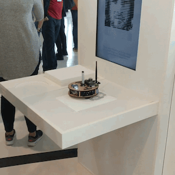

# Vision AI
------- 

Vision AI is a flexible and powerful tool to help developers to bring CV/ML solutions for their Mobile Android projects. 

The library reduces the amount of boilerplate code for creating an infrastructure around ML such as - Retrieving video frames and converting it into arrays of color data, Normalizing data, Down/Upscaling of bitmaps, etc - and helps developers be focused on main ML part of the app. With that VisionAI provides simple and understandable API for new ML algorithms and ["Processing Steps"](visionai-core/src/main/java/com/bendenen/visionai/videoprocessor/ProcessorStep.kt).

The tool makes it easy to analyze video streams or separate frames and apply ML effects for it. Just in several lines of code!

  

AndroidDevChallenge
-------

This project (repository) participates in the [AndroidDevChallenge](https://developer.android.com/dev-challenge). So as part of that, the [Cover Letter](AndroidDevChallenge/Android_Dev_Challenge-Cover_Letter-Vision_AI.pdf) is presented into the dedicated folder "AndroidDevChallenge".

License
-------
Apache 2.0. See the [LICENSE](LICENSE) file for details.